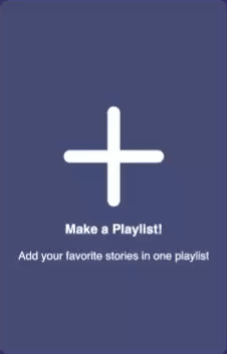

# Intro
Tumi-Mundo is een platform dat zich richt op het verbeteren en stimuleren van de taalontwikkeling van baby's van 6 maanden tot een jaar. Dit is belangrijk omdat een goede taalontwikkeling veel voordelen heeft, zoals het verbeteren van het leerproces, het verminderen van geestelijke gezondheidsproblemen en het vergroten van sociale vaardigheden.

Als schoolproject heb ik de opdracht gekregen van Tumi Mundo om de frontend van hun website te maken. Het algemene doel van dit project is om de aangeleverde ontwerpen en functionaliteiten te realiseren. 


## Inhoudsopgave
- [Intro](#intro)
  - [Inhoudsopgave](#inhoudsopgave)
  - [Beschrijving](#beschrijving)
  - [Het ontwerp](#het-ontwerp)
    - [Create playlist button](#create-playlist-button)
    - [open/close form](#openclose-form)
    - [Submit form](#submit-form)
  - [Kenmerken](#kenmerken)
    - [HTMl-structuur](#html-structuur)
    - [CSS](#css)
    - [Javascript](#javascript)

## Beschrijving
De nadruk van deze sprint was het maken van een interactieve element. Het interactieve element dan ik wilde gaan realiseren is de interacties die de gebruiker moet uitvoeren om een playlist aan te maken. het is hierbij de bedoeling dat de gebruiker op een button klikt om vervolgens een form te laten verschijnen. In de form kan de gebruiker een cover afbeelding uploaden en de playlist een titel geven. Als de gebruiker vervolgens op de submit knop drukt zal de playlist card tevoorschijn komen tussen de andere bestaande playlists. 


## Het ontwerp

### Create playlist button
Het ontwerp van de button om de form te laten verschijnen is hetzelfde gebleven als de vorige sprint. Bij het ontwerp van de button heb ik goed nagedacht of de button duidelijk maakt waarvoor het kan worden gebruikt. Om duidelijk te maken dat de button klikbaar is heb ik hover-effecten en een cursor pointer gebruikt.

<br>



### open/close form
Als er op de create playlist button wordt gedrukt, schuift de form van beneden naar boven met een animatie. Dit maakt voor de gebruiker duidelijk dat de klik op de button iets heeft laten gebeuren. De form heeft zelf ook een button waarmee de gebruiker de form kan sluiten. De form schuift vervolgens met een vloeiende animatie naar beneden.

<br>


### Submit form
Doormiddel van labels, placeholders en hovers word duidelijk vermeldt en zichtbaar gemaakt dat de elementen input nodig hebben van de gebruiker. De gebruiker kan de playlist een naam geven en een cover afbeelding. Er wordt gecontroleerd of beide input-forms ingevuldt zijn. Is dit niet het geval wordt dit aangegeven. De form kan pas worden verzonden als beide input-forms ingevuldt zijn. Als de gebruiker de informatie heeft ingevoerd en vervolgens op de knop "make playlist" klikt sluit de form automatisch. Dit laat de gebruiker zien dat de handeling is gelukt. Uiteindelijk is het voor extra feedforward om de card met een zichtbare animatie tevoorschijn te laten komen. Zodat de gebruiker extra duidelijkheid heeft.

<br>


## Kenmerken

### HTMl-structuur
Ik heb de standaard HTML-structuur gebruikt om de applicatie te bouwen. Dit maakt het makkelijk om te begrijpen en te onderhouden. Ik heb ervoor gezorgd dat alles goed is georganiseerd en logisch is. Ook heb ik gekeken naar toegankelijkheid voor iedereen door de WCAG-richtlijnen te volgen. Zo kunnen ook mensen met andere behoeftes, zoals gebruikers van schermlezers, de applicatie goed gebruiken. De pagina's zijn allemaal getest met de html validator, lighthouse test en handmatige tests.

### CSS
Voor de CSS heb ik me gefocust op zowel de layout als de styling van de applicatie. Ik heb ervoor gekozen om de basis van het ontwerp dicht bij de aangeleverde designs te houden, Tegelijkertijd heb ik mijn eigen ideeën toegevoegd om het ontwerp eigen te maken. Ook heb ik goed geluisterd naar de feedback die ik heb ontvangen van voorgaande sprints. Deze sprint heb ik ook gebruik gemaakt van een gezamelijke stylesheet dan mogelijk maakt om basis styling gezamelijk te houden.

### Javascript

Om de form values in de cards te krijgen heb ik gebruik gemaakt ```.value``` voor de titel. Dit heb ik vervolgens in een variabele gezet waardoor ik de value van de input gemakkelijk via de variabele kan benaderen. Voor de image is er andere syntax namelijk: ```const selectedFile = imageUpload.files[0];```. Hier heb ik de value van de file input in de variabele ```selectedFile``` gezet.
Deze forms worden natuurlijk van te voren eerst door ```getElementById``` geselecteerd.

```const imageUpload = document.getElementById("image-upload");``` 
```const titleInput = document.getElementById("title-input").value;```


De interactieve elementen in de pagina zijn gemaakt met Javascript. het principe om de cards te maken doormiddel van de form heb ik gemaakt door de elementen van bestaande cards te maken in javscript met het ``` createElement``` method. Vervolgens heb ik classes toegevoegt met de ```classListadd``` method. Met ```appenChild``` heb ik vervolgens alle elementen in elkaar gevoegt naar behoren waardoor hetzelfde structuur is aangemaakt als de bestaande cards.

Link naar volledige javacript met aanvullende commentaar per regel: https://github.com/Ravirkt/fix-the-flow-interactive-website/blob/07244c1972f9fdad779bcbf57ed1b995e80f1a3d/javascript/lessons.js#L47-L158


